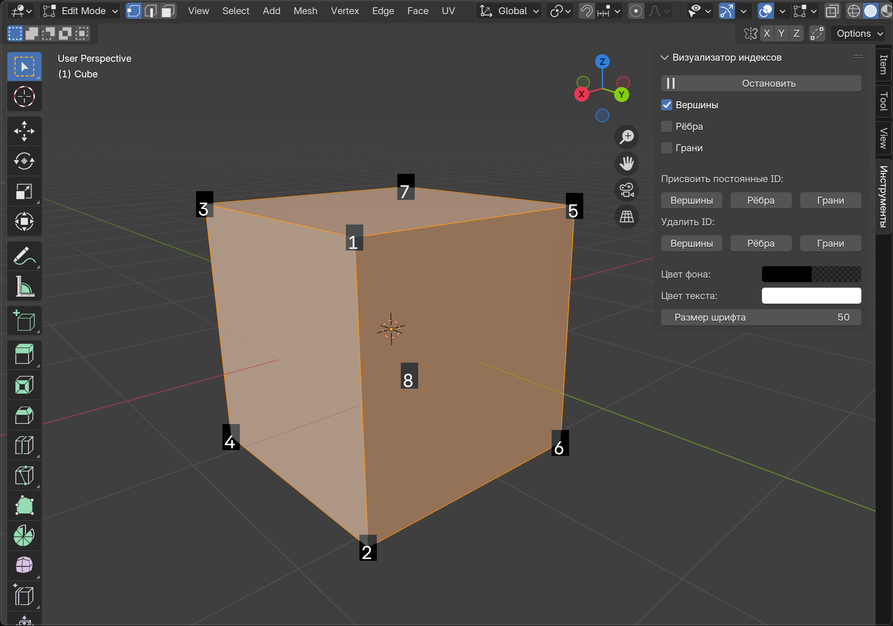

# Визуализатор индексов для Blender

## Описание
Это аддон для Blender, который позволяет управлять и визуализировать персистентные ID элементов меша (вершин, рёбер и граней) непосредственно в 3D-вьюпорте. Аддон сохраняет ID в custom data layers, обеспечивая их сохранность при изменении топологии или трансформациях объекта.

## Ключевые возможности
- Отображение персистентных ID выделенных элементов (вершин, рёбер, граней)
- Сохранение выделения при переключении между Edit Mode и Object Mode
- Назначение уникальных персистентных ID выделенным элементам
- Удаление ID у выделенных элементов
- Настройка внешнего вида: цвет фона, цвет текста, размер шрифта
- Горячая клавиша (Ctrl+Shift+I) для быстрого включения/выключения

## Установка
1. Скачайте последнюю версию аддона как ZIP-архив
2. Запустите Blender и откройте Preferences (Edit → Preferences)
3. Перейдите на вкладку Add-ons
4. Нажмите кнопку "Install..." и выберите скачанный ZIP-файл
5. Включите аддон, установив галочку рядом с его названием в списке
6. Закройте окно Preferences

## Использование
### Основы
1. Выберите mesh-объект
2. Найдите панель "Визуализатор индексов" на боковой панели в 3D-вьюпорте (вкладка "Инструменты")
3. Нажмите кнопку "Запустить" (или используйте горячую клавишу Ctrl+Shift+I)

### Назначение и управление ID
1. В режиме редактирования (Edit Mode) выделите нужные элементы
2. Используйте кнопки "Вершины", "Рёбра" или "Грани" в секции "Присвоить постоянные ID"
3. Для удаления ID используйте соответствующие кнопки в секции "Удалить ID"

### Работа с выделением
- Выделите элементы в Edit Mode
- Переключитесь в Object Mode - выделенные элементы будут отображаться с их ID
- При возврате в Edit Mode, ваше выделение сохранится

### Настройка отображения
- Используйте чекбоксы для выбора типов элементов для отображения
- Настройте цвет фона, цвет текста и размер шрифта с помощью соответствующих контролов

## Технические детали
- ID хранятся в custom data layers: `persistent_vert_id`, `persistent_edge_id`, `persistent_face_id`
- Состояние выделения сохраняется в слоях: `iv_vert_selected`, `iv_edge_selected`, `iv_face_selected`
- Нумерация элементов начинается с 1

## Системные требования
- Blender 4.0+

## Лицензия
MIT

## Автор
@vffuunnyy
